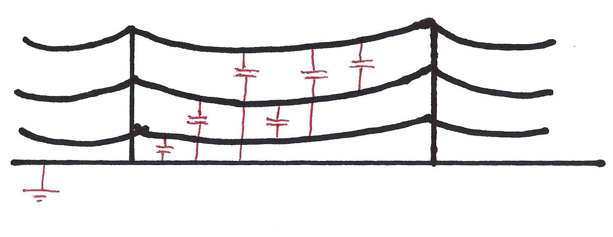

# Capacitance and Complexity

## Capacitance is parasitic.

This is a diagram of all the capacitance in the national grid system. This delays the circuits output and also uses energy charging and discharging these "capacitors".

Capacitance is worst at high power or high frequency. This is where the ideal equations break down and become less accurate. When pushing systems to their limit you must consider all effects, not just the obvious ones. 

Heat is also a parasitic effect, increasing resistance and wasting energy. 

## The Ideal Capacitor

Note that the voltage across a capacitor cannot change instantly, because in $I = C\frac{dV}{dt}$, $dt$ cannot be zero because that would imply $frac{dV}{dt} = \infty \therefore I = \infty$, which is impossible.

Increasing V quickly will give a big $\frac{dV}{dt}$, and therefore a big current, proportionally to $C$. Therefore with a small $C$ you can easily have a small $dt$.

Therefore, in practice we want a small $C$ and a big $\frac{dV}{dt}$ to give a reasonable $I$.

So the job of a chip designer is to make C small.

*A side note:* In a DC circuit $V$ and $I$ are constant, therefore 
$\frac{dV}{dt} = 0$ and capacitors can be ignored.
