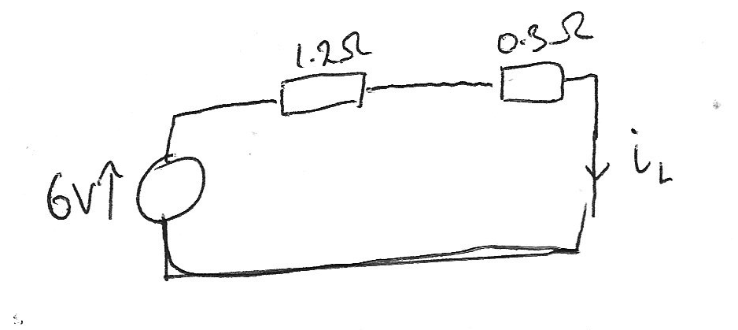

# Complex Example

> 
>
> After being in position A for a long time the switch moves to position B > at $t = 0$. 
>
> Derive an equation for the current $i_L$ though the inductor for $t > 0$.

Because the question says "after a long time" this means that current and voltages will be constant, so we start by working out the current just before the switch is toggled.

At DC the inductor will act as a short circuit, so the $0.7\Omega$ resistor is shorted out, meaning the circuit before $t=0$ is effectively a circuit with only a power source and two resistors. 

So you can easily calculate the current here using Ohm's Law.

$$ i_L = \frac{V}{R} = \frac{6}{0.3 + 1.2} = 4A $$

And because the current in an inductor cannot change instantly we then know that

$$ i_L(0) = 4A $$

Now, after $t = 0$ the circuit can be described as this

Because there is only one connection between loops A and B, there is not interaction between them, so for us we only need to consider loop B, and inductor discharging over a resistor, an RL Circuit.

Which has the solution

$$ i_L(t) = I_0 e^{-\frac{R}{L}t} $$

$$ i_L(t) = I_0 e^{-\frac{0.7}{4.2}t} $$

Which simplifies, and using the initial condition from earlier

$$ i_L(t) = 4 e^{-6t} $$

