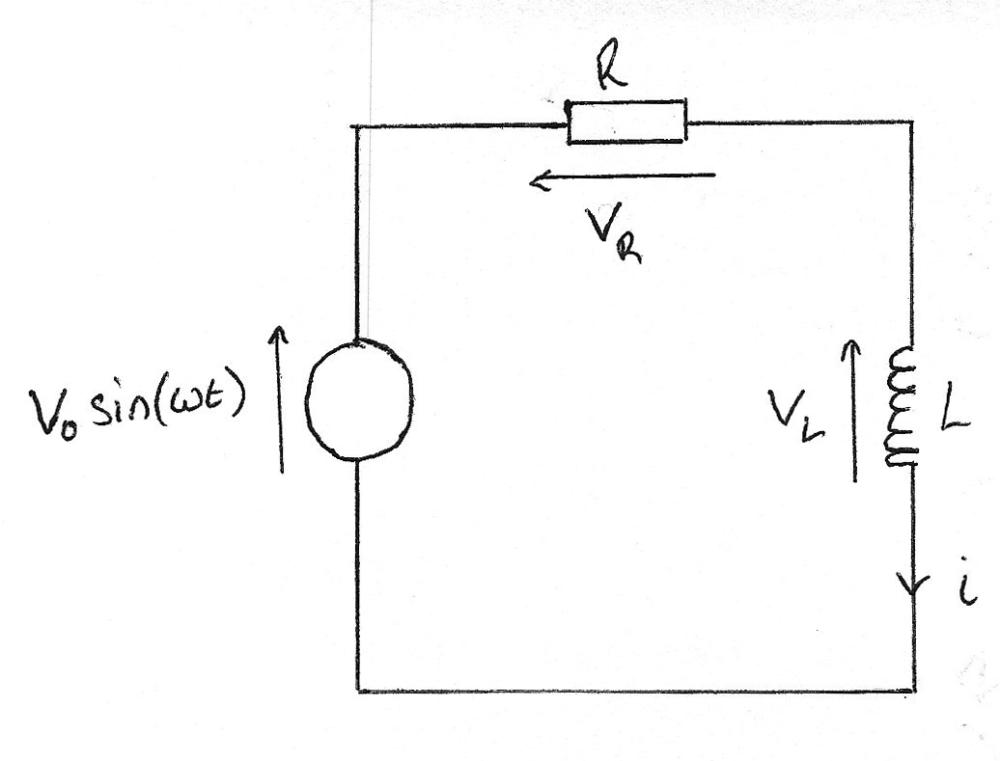
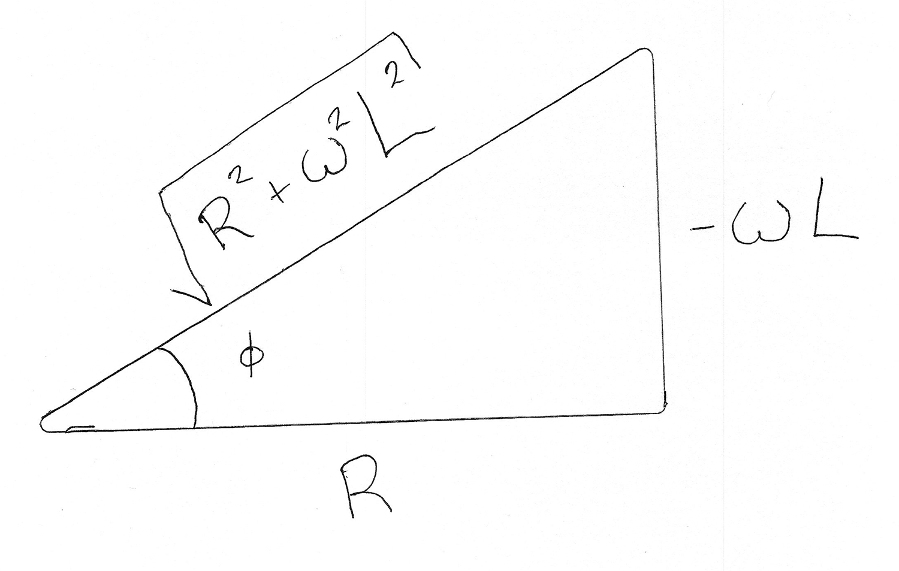

# Sinusoidal Sources

You can introduce a sinusoidal source into a circuit, with $V = V_0\sin\omega t$. The Fourier series says that you can decompose any signal into the sum of sine waves. The response to single sine waves is called AC theory. 

**KVL:** $V_0\sin(\omega t) - V_R - V_L = 0$  
**KCL:** One loop therefore one current $i$

A combination with the ideal relations gives

$$ \frac{di}{dt} + \frac{R}{L}i = \frac{V_0}{L}\sin(\omega t) $$

To which we can guess a solution

Guess

$$ i(t) = I_0 \sin (\omega t + \phi) $$

Differentiate

$$ \frac{di}{dt} = I_0\omega\cos(\omega t + \phi) $$

Substitute

$$ I_0\omega\cos(\omega t + \phi) + \frac{R}{L}I_0 \sin (\omega t + \phi) = \frac{V_0}{L}\sin(\omega t) $$

To verify that this is correct we need to find values of $(I_0, \phi)$ that work for $t\ge0$.

So, for $t = 0$

$$ 0 = I_0\omega\cos(\phi) + \frac{R}{L}\sin(\phi) $$

Factorising $I_0$

$$ \omega\cos(\phi) + \frac{R}{L}\sin(\phi) = 0 $$

Then, dividing though by $\cos(\phi)$

$$ \omega + \frac{R}{L}\tan(\phi) = 0 $$

So, for our guess to be correct

$$ \phi = \tan^{-1}\bigg(-\frac{\omega L}{R}\bigg) $$

Then, you can do the same for $t = \frac{\pi}{2\omega}$. You use this value because it shifts a sine function into the cosine function, and the cosine function to the negative of the sine function.

$$ I_0\omega\cos(\omega t + \phi) + \frac{R}{L}I_0 \sin (\omega t + \phi) = \frac{V_0}{L}\sin(\omega t) $$

$$ \frac{V_0}{L}\sin\big(\frac{\pi}{2}\big) = I_0\cos\big(\frac{\pi}{2} + \phi\big) + \frac{R}{L}I_0\sin\big(\frac{\pi}{2} + \phi\big) $$

$$ \frac{V_0}{L} = -I_0\sin(\phi) + \frac{R}{L}I_0\cos(\phi) $$

Now, using trigonometric identities you can find a nicer expression for substitution, using our know value for $\phi$.

$$ \sin\phi = \frac{-\omega L}{\sqrt{R^2 + \omega^2 L ^2}} $$

$$ \cos\phi = \frac{R}{\sqrt{R^2 + \omega^2 L ^2}} $$

Then, by substitution

$$ \frac{V_0}{L} = -I_0\omega\bigg(\frac{-\omega L}{\sqrt{R^2 + \omega^2 L ^2}}\bigg) + I_0\frac{R}{L}\bigg(\frac{R}{\sqrt{R^2 + \omega^2 L ^2}}\bigg) $$

$$ \frac{V_0}{L} = \frac{I_0}{L}\frac{R^2 + \omega^2 L ^2}{\sqrt{R^2 + \omega^2 L ^2}}$$

$$ \frac{V_0}{L} = \frac{I_0}{L}\sqrt{R^2 + \omega^2 L ^2}$$

$$ I_0 = \frac{V_0}{\sqrt{R^2 + \omega^2 L ^2}} $$

If the guess is correct then our equations for $I_0$ and $\phi$ are correct. So finally we have to verify our solution by a final substitution back into $i(t)$

$$ i(t) = \frac{V_0}{\sqrt{R^2 + \omega^2L^2}}\sin\bigg(\omega t - \tan^{-1} \big(\frac{\omega L}{R}\big)\bigg) $$
